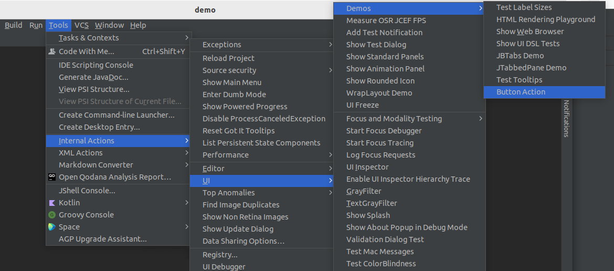
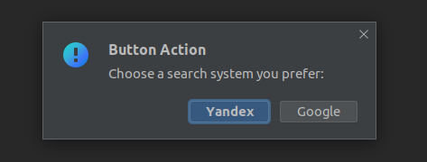

# IDEplugin

Here you can find my solution for implementing a basic plugin for IntelliJ-based IDE that adds an additional button (action) to the UI.

 The action is located in `Tools -> Internal actions -> UI -> Demos`:

When a user clicks on this button, it should open a modal window with a choice of two buttons:

Each of these buttons should open a URL of your choice in the internal browser.

